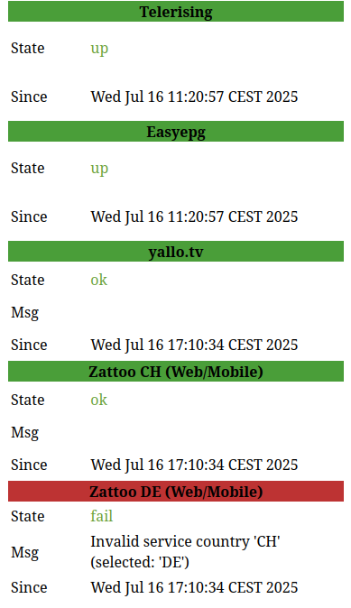

# Telerising AIO Image

* Telerising
* EasyEPG
* Health Check

## ENV Variables

| Key                 | Value | Default | Optional | Description                           |
|---------------------|-------|---------|----------|---------------------------------------|
| TZ                  | any   |         | Y        | example: Europe/Berlin                |
| TR_DISABLE          | any   |         | Y        | if set, telerising is disabled        |
| EPG_DISABLE         | any   |         | Y        | if set, easyepg is disabled           |
| HEALTH_DISABLE      | any   |         | Y        | if set, healthcheck is disabled       |
| TRUPDATE            | Y     |         | Y        | Update Telerising on Docker restart   |
| HEALTH_INT          | num   | 300     | Y        | healthcheck interval, seconds         |       
| HEALTH_HOOK         | URL   |         | Y        | Post HEALTH Status to this URL        |
| HEALTH_MQTT_HOST    | HOST  |         | Y        | mqtt hostname                         |
| HEALTH_MQTT_PORT    | PORT  | 1883    | Y        | optional, mqqt port                   |
| HEALTH_MQTT_TOPIC   | TOPIC |         | Y        | send to this topic                    |
| HEALTH_MATRIX_URL   | URL   |         | Y        | matrix server url                     |
| HEALTH_MATRIX_ROOM  | ID    |         | Y        | matrix room send message to           |
| HEALTH_MATRIX_TOKEN | TOK   |         | Y        | you matrix token                      |
| http_proxy          | URL   |         | Y        | useful if you want to use telerising  |
| https_proxy         | URL   |         | Y        | his new proxy feature and route all   |
|                     |       |         |          | traffic through a proxy server        |
## Volumes

| Volume      | Description        |
|-------------|--------------------|
| /telerising | telerising storage |
| /easyepg    | easyepg storage    |

## Ports

| Port | Description        |
|------|--------------------|
| 3000 | json status output |
| 3001 | html status output |
| 4000 | easyepg port       |
| 5000 | telerising port    |

## Examples

### Json Output
```
curl -s http://telerising:3000|jq
```

```
{
  "code": 0,
  "msg": "health check working",
  "telerising": {
    "state": "down"
  },
  "easyepg": {
    "state": "up",
    "since": "1752657657",
    "since_human": "Wed Jul 16 11:20:57 CEST 2025"
  },
  "y3o": {
    "state": "ok",
    "name": "yallo.tv",
    "since": "1752678634",
    "since_human": "Wed Jul 16 17:10:34 CEST 2025"
  },
  "zc2": {
    "state": "ok",
    "name": "Zattoo CH (Web/Mobile)",
    "since": "1752678634",
    "since_human": "Wed Jul 16 17:10:34 CEST 2025"
  },
  "zd2": {
    "state": "fail",
    "name": "Zattoo DE (Web/Mobile)",
    "since": "1752678634",
    "since_human": "Wed Jul 16 17:10:34 CEST 2025"
  },
  "time": "1752682253",
  "time_human": "Wed Jul 16 18:10:53 CEST 2025"
}
```

### Web Status
```
http://telerising:3001
```

